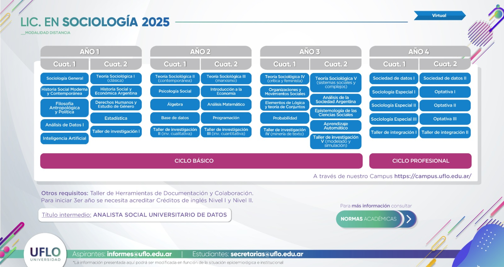

# Bienvenidos!

En este repositorio compilamos las actividades que realizamos en la Licenciatura en Sociología de UFLO.  Nuestra carrera tiene una orientación computacional que busca, entre otros objetivos, integrar saberes digitales y nuevas tecnologías con una mirada social crítica y epistemológicamente fundada. 

Cualquier consulta o comentario, nos podes escribir a *sociologia (arroba) uflouniversidad.edu.ar*

1. [Próximos Eventos](#próximos-eventos)
2. [Publicaciones](#publicaciones)
3. [Recursos abiertos: eventos, clases, tutoriales, materiales didácticos](#recursos-abiertos)
4. [Módulos de nuestras asignaturas](#módulos)
5. [Proyectos de Investigación](#proyectos-de-investigación)
6. [Desarrollos y herramientas en Sociología Computacional](#desarrollos-y-herramientas)

## Próximos Eventos

{% assign hoy = site.time | date: "%Y-%m-%d" %}



  
  

  
    
      

        <h3>{{ e.titulo }}</h3>
        
<strong>{{ e.fecha }}</strong> · {{ e.hora }} — {{ e.modalidad }} · {{ e.lugar }}

        
{{ e.descripcion }}

        
<a class="btn" href="{{ e.formulario }}" target="_blank" rel="noopener">Inscribirme</a>

      

    
  
  


  
No se encontró <code>_data/eventos_futuros.yml</code> o tiene un error de formato.



<a class="cta" href="https://forms.gle/eFxcxuWV1c8oki5CA" target="_blank" rel="noopener">
  📬 Recibir novedades de próximos eventos gratuitos y abiertos
</a>

## Publicaciones

  
  

    <h3>Desarrollos en Ciencias Sociales Computacionales</h3>
    

      Desde 2024/2025 editamos la revista <strong>Desarrollos en Ciencias Sociales Computacionales (DCSC)</strong>, 
      un espacio de difusión e intercambio del trabajo de estudiantes, docentes, investigadores/as y profesionales 
      en el campo de las ciencias sociales computacionales. Publica artículos teóricos, empíricos y pedagógicos, 
      herramientas computacionales, reseñas y dossiers temáticos.
    

    <a class="revista-btn" href="https://revistadesarrollos.uflo.edu.ar/" target="_blank" rel="noopener">Ver OJS de la revista</a>
  

  
  

    <h3>Mitos y representaciones de la Inteligencia Artificial</h3>
    
<strong>Editores:</strong> Gastón Becerra · Joaquín Ignacio Mezzadra · Guillermo Movia

    

      El presente libro es el fruto de un trabajo colectivo que involucró estudiantes, profesores e investigadores, en el que nos embarcamos a discutir cómo entendemos la inteligencia artificial (IA). El resultado es una serie de reflexiones que interpelan a la IA para visibilizar sus dimensiones sociales y discutir sus impactos.
    

    <a class="libro-btn" href="https://repositorio.uflo.edu.ar/entities/libro/ba249a4e-a837-4003-bad7-b215cc0d3b32" target="_blank" rel="noopener">Ver en repositorio UFLO</a>
  

## Recursos Abiertos

  <input id="search-input" placeholder="Buscar…">
  <ul id="results"></ul>



  <input id="filtro-texto" type="search" placeholder="Buscar por título, autor, descripción">
  

    
    
      
        
          
            {{ tags_raw }}|{{ t }}|
          
        
      
    
    
    
      
        <button class="chip" data-tag="{{ t | strip }}">{{ t }}</button>
      
    
  

  <button id="filtro-clear" class="btn">Limpiar</button>


  
  
  

  
    

      

        <iframe width="100%" height="200" src="https://www.youtube.com/embed/{{ r.yt_id }}" title="{{ r.titulo }}" frameborder="0" allowfullscreen></iframe>
      

      <h3>Ep. {{ r.episodio }} — {{ r.titulo }}</h3>
      
<strong>Entrevista a:</strong> {{ r.entrevistado }}

      
{{ t }}

    

  
    <a class="card card-{{ r.tipo }}" href="{{ link }}" target="_blank" rel="noopener" data-tags="{{ r.tags | join: ',' }}">
      
        
      
        
      
        

      

      <h3>💻 {{ r.titulo }}</h3>

      
        
          

            {{ r.subtipo | replace: "_", " " }}
            {{ r.anio }}
             · {{ r.autores | join: ", " }}
             · {{ r.fuente }}
          

          
{{ r.descripcion }}


        
          
{{ r.lenguaje }}

          
{{ r.descripcion }}


        
          

            {{ r.fecha }}
             · 
            {{ r.duracion }}
             · {{ r.medio }}
          

          
{{ r.descripcion }}

      

      
{{ t }}

    </a>
  


Estos materiales son resultados del trabajo de nuestras asignaturas y equipos de investigación. Los **podcasts** se elaboraron en las asignaturas *Teoría Sociológica Clásica* y *Teoría Sociológica Contemporánea*. Para una bitácora y reflexión, podés consultar la ponencia:
Ciardiello, M., Giordano, P. y Becerra, G. (2023). Experiencias en la producción de podcasts de teoría sociológica. *IV Jornadas Institucionales de Innovación Educativa en la Universidad - Universidad de Flores*. https://repositorio.uflo.edu.ar/entities/ponencia/be9853f1-f1c5-4744-a85a-1263ee95fb09

[Todos los encuentros: https://bit.ly/conversatorios-uflo](https://bit.ly/conversatorios-uflo)

## Módulos

Estos son algunos de los contenidos y temas de algunas materias de la carrera. 
Por cuestiones de privacidad, sólo listamos contenidos asincrónicos (y no las actividades sincrónicas con estaudiantes). 

- **Módulo**: **"El análisis de datos y la Sociología"**  
**Asignatura**: *Análisis de datos* - [Programa de la materia](https://docs.google.com/document/d/1A_hDY1bkpvRAaeU5WOAqpQlbtdAxzQOV/edit)  
**Tramo**: Habilidades digitales - Estudiantes de 1er año  
En este módulo buscamos fomentar una mirada crítica de los desarrollos tecnológicos vinculados con el big data y las ciencias de datos, y su relación con la sociología.

    - Tema 1: Ciencias de datos y sociología - Evaluamos la "crisis metodológica" de la sociología: [Exposición en video](https://www.youtube.com/watch?v=RT94SEVf20k) y [material de lectura: "Los desafíos del big data para la formación sociológica"](https://jornadas.virtual.uflo.edu.ar/?p=2410)
    - Tema 2: Problemas éticos en las ciencias de datos - Introducimos una mirada sociológica de la ética de la investigación: [Exposición en video](https://youtu.be/V-h_h5DOQCg)
    - Tema 3: Epistemología de las ciencias de datos - Exponemos y discutimos  el paper R. Kitchin [Exposición en video](https://youtu.be/VVYCMaT9xgQ) y [material de lectura: "Big Data, new epistemologies and paradigm shifts"](http://journals.sagepub.com/doi/10.1177/2053951714528481)

 

- **Módulo**: **"La ciencia como comunicación"**  
**Asignatura**: *Taller de Herramientas de Documentación y Colaboración* - [Programa de la materia](https://docs.google.com/document/d/1xaybSimckdOUN9DuUmXO6J3ds_iTP46x/edit?usp=sharing&ouid=110060493895495443798&rtpof=true&sd=true)  
**Tramo**: Metodológico - Estudiantes de 1er año  
En este módulo exploramos una manera de observar la ciencia como un sistema de comunicación (y no como una forma de pensamiento), y cuáles son sus canales y convenciones.

    - Tema 1: La ciencia como comunicación - Caracterizamos a la ciencia como un sistema de comunicación: [Exposición en video](https://youtu.be/3pG4DtKNdNA)
    - Tema 2: Buscadores y redes científicas - Presentamos los canales típicos de la comunicación científica: [Exposición en video](https://youtu.be/Cr9cYWMr2LY)
    - Tema 3: ¿Cómo leer artículos y ponencias? - Nos introducimos a dos géneros de la comunicación científica y leemos 2 ejemplos: [Exposición en video](https://youtu.be/Dmk2U8DgnEc), [Ejemplo 1: "Hacia una exploración de las representaciones sociales en torno al big data"](https://drive.google.com/file/d/1bOmgIK8QWZcB3Dg-4L83W2qICMguMn4z/view?usp=sharing) y [Ejemplo 2: "Adieu à Bourdieu? Asimetrías, límites y paradojas en la noción de habitus. Convergencia Revista de Ciencias Sociales"](https://drive.google.com/file/d/1YWpjhLuEuYzdmHz1RNED0_LvLVzo5u8A/view?usp=sharing)
    - Tema 4: Gestores de bibliografía - Mostramos el software Mendeley para manejar bibliografía y citado: [Exposición en video](https://youtu.be/n1UYMaLxSBQ)

 

- **Módulo**: **"Camino hacia la elección del diseño de investigación"**  
**Asignatura**: *Taller de Investigación I* - [Programa de la materia](https://docs.google.com/document/d/1WjJsNzH5UqCfeqlRLufFBwPl1OsRcxc9/edit)  
**Tramo**: Metodológico - Estudiantes de 1er año  
En este módulo nos introducimos al proceso de investigación, a través de sus diseños más comunes, la construcción del marco teórico y una guía rápida para escribir objetivos.

    - Tema 1: Idea, diseños y enfoques - Algunas nociones previas a dar el primer paso de investigación [Exposición en video](https://youtu.be/N5MrhOCmgPU)
    - Tema 2: El marco teórico - Nuestros anteojos sociológicos para hacer preguntas [Exposición en video parte 1](https://youtu.be/8Zp6wNq7MJI) + [Exposición en video parte 2](https://youtu.be/nTdm6yzuLRw) + Un ejemplo: la teoría de las representaciones sociales [Exposición en video](https://youtu.be/XVN3shrWgA4)
    - Tema 3: Objetivos de investigación - Una guía rápida para leer/ escribir un objetivo de investigación [Exposición en video](https://youtu.be/) + [Material de lectura: "Consejos y advertencias para la formación de investigadores en ciencias sociales (C.Wainerman)" ](http://www.catalinawainerman.com.ar/pdf/Consejos_y_advertencias_para_la_form_de_investigadores.pdf)

## Proyectos de Investigación

Aquí linkeamos a nuestros proyectos de investigación (completos, con marco teórico, objetivos, antecedentes, bajada metodológica y presupuesto) que ya fueron evaluados y aprobados por un comité externo.

- [Proyecto: Indagaciones en torno a la Equidad de Género y Diversidad Sexual](https://docs.google.com/document/d/e/2PACX-1vQxlAOlzGBGe4lbRkex1X5yYnhtH-uVUE2PxY_0HOwrHCeed4gY5t_Sk0e489eymqYPY8l0dZbrmZzg/pub) / 2024 / Proyecto empírico tendiente a transversalizar la perspectiva de género y el paradigma de los Derechos Humanos para impulsar el avance y la efectivización de derechos de mujeres, disidencias y diversidades sexuales.

- [Proyecto: Recursos computacionales para investigación en torno a la Teoría de Sistemas Sociales (también llamado *DataLuhmann*)](https://docs.google.com/document/d/e/2PACX-1vQvnVTcjm8o7LkCWwTFlj7qp9A5kUIQz0od0M5Vv4VHxMNjWFInitI-tqs9GXz-EqhonNUxwkHnHW_p/pub) / 2023 / Proyecto computacional tendiente a generar recursos para la investigación en el campo de la Teoría de los Sistemas Sociales.

- [Proyecto: Exploraciones empíricas y teóricas sobre problemáticas socio-tecnológicas en perspectiva psicosocial](https://docs.google.com/document/d/e/2PACX-1vQhdUFEWPUx4oEq9ambhQvsHAiii1YK-fJaoCNldkPY5N3Sb5CVGJcA5DJOwhUS6M_w9OA6oz8QiGi5/pub) / 2022 / Proyecto empírico, con perspectiva psico-social, sobre fenómenos y procesos sociales vinculados con el big data, los algoritmos y las criptomonedas.

- [Proyecto: La Teoría de los Sistemas Sociales en las dicotomías de la sociología contemporánea](https://docs.google.com/document/d/e/2PACX-1vTccXsWLV5cYNQO62CM2dICtWI0sJshi2C_iVx3W9zu5E_x7WyJJxj9oxSoIHHyTR-PZTyYS9SADgde/pub) / 2022 / Proyecto teórico que busca contribuir a avanzar la elucidación de aspectos críticos y controversiales de la Teoría de los Sistemas Sociales.

- [Proyecto: Incorporación de la Inteligencia Artificial en la educación universitaria](https://docs.google.com/document/d/1kTa5oWwhzRlTPxeyWUcS74SoUd3rPDxUv0FnpnSwZaw/edit?usp=sharing) / 2023 / Proyecto junto a la Comunidad Internacional de Investigación Educativa (CIIED), que vincula a investigadores de Ciencias de la Educación y las Ciencias de Sociales de Perú, Argentina, Brasil, España, Chile y Japón.

## Desarrollos y herramientas

Generamos herramientas de código abierto para asistir a distintos momentos de la investigación social. Algunos de estos desarrollos son:

- [minCaqdasR](https://github.com/gastonbecerra/mincaqdasr) **(en desarrollo!)**  - Herramienta para análisis cualitativo (CAQDAS), diseñada para asistir en la tarea de codificar o anotar un corpus de documentos o fragmentos de los mismos, a través de una interfaz gráfica (GUI) que corre en cualquier navegador que tenga JavaScript habilitado, y que se puede vincular con R.

- [ojsr](https://cran.r-project.org/web/packages/ojsr/index.html) - Package de R para navegar y hacer webscraping de revistas electrónicas editadas con Open Journal System. La documentación está en inglés... pero acá hay un [artículo en castellano](https://dspaceapi.uai.edu.ar/server/api/core/bitstreams/5b8cc797-032a-4611-ab00-a5ae5acce1d8/content).
